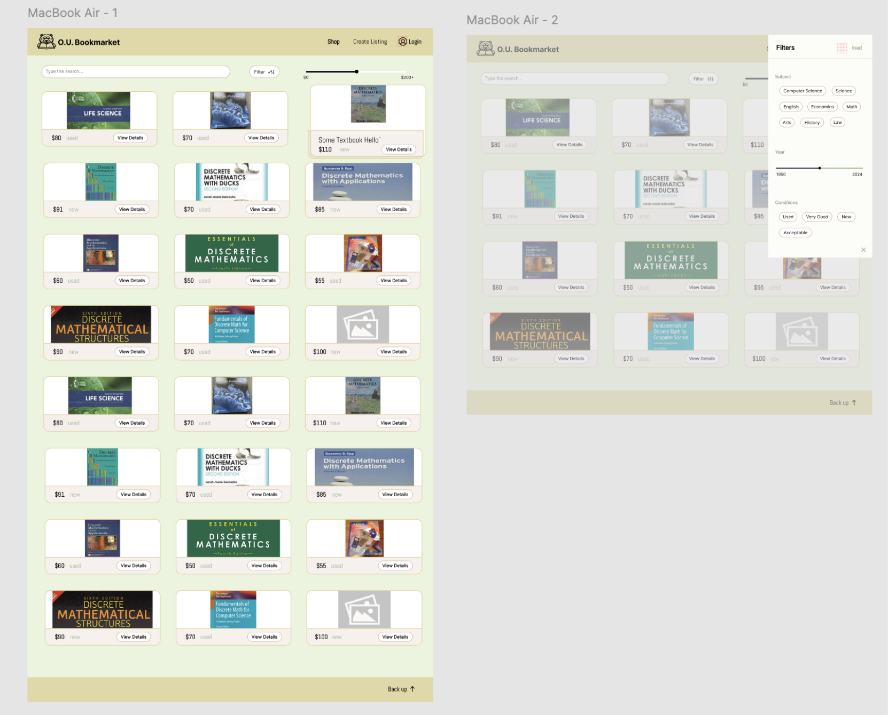
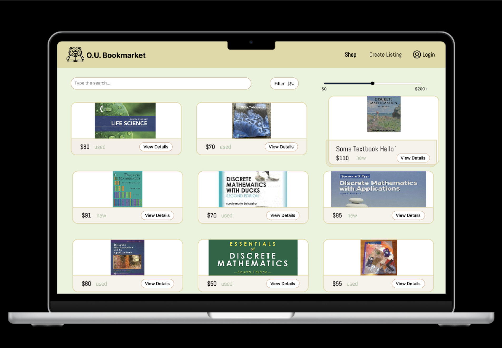
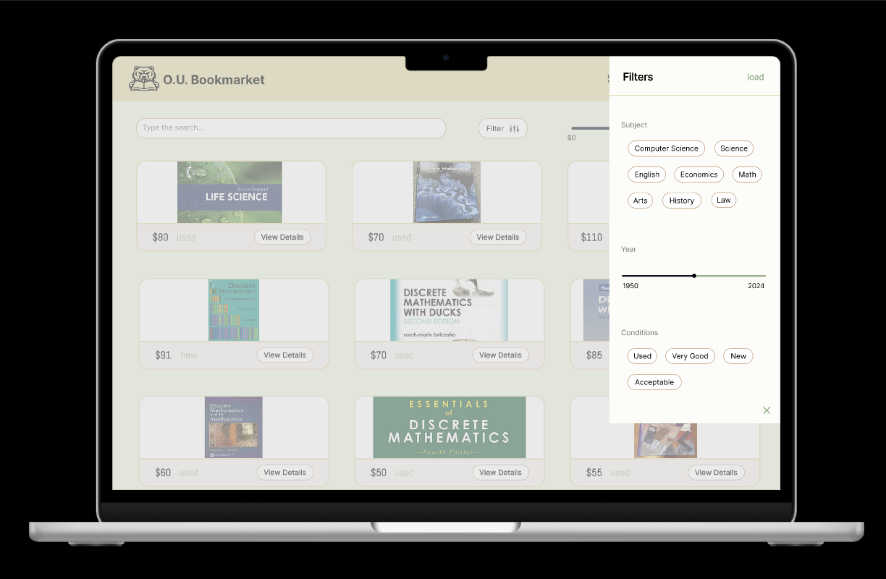

# UI Mockups through Figma

## First draft of the Desktop UI

### Color Scheme using Realtime Colors

- Text: #06031e
- Background: #eaf3dd
- Primary: #e5dfb7
- Secondary: #caa381
- Accent: #99b593

### Header

Bookmarket's title and logo

Contain all the components for the website such as:
- Shop
- Create Listing 
- Login

### Shop Page   

*scrollable*

Shop page, with features for user-friendly features:
- Search bar (title, author)
- Filter (clickable) (subject, year, conditions)
- Price slider 

With each lsiting contains:
- Image (upload by user)
- Price
- Condition
- View Details button

### Footer

Back up button (clickable): bring user up to the header

### Demo on a MacBook Air

